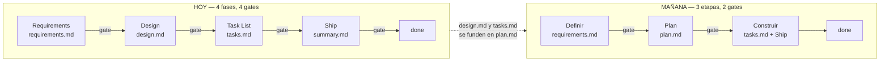
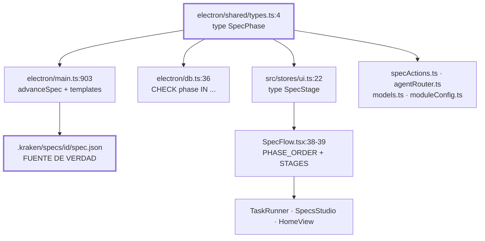
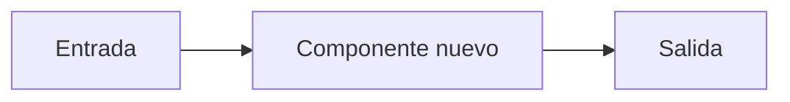
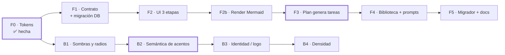
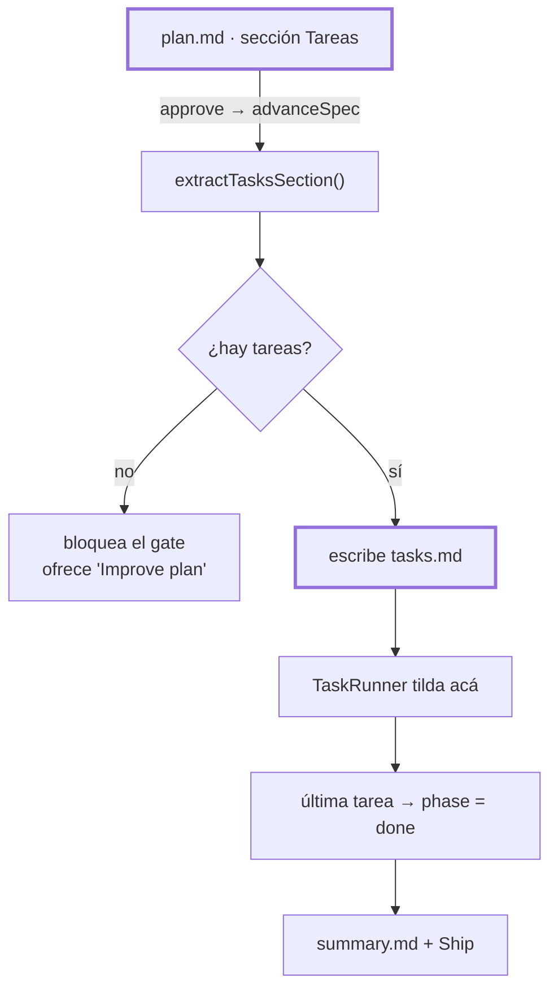
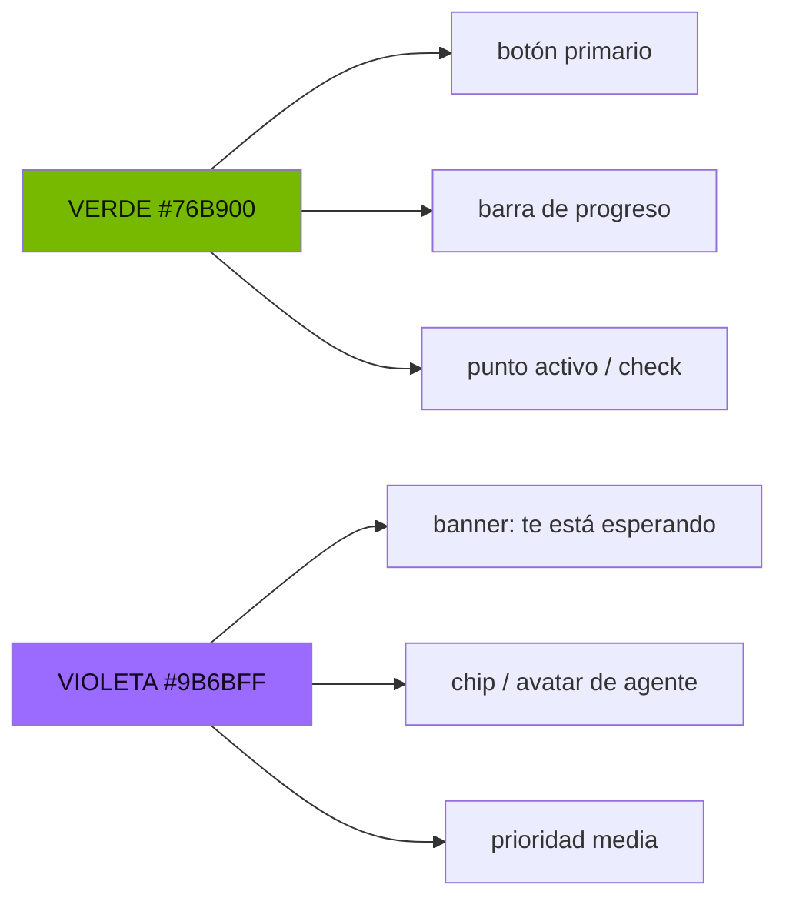

# Refactor — **Definir · Plan · Construir** + rebranding *Signal*

  

> **TL;DR** — Kraken pide hoy **4 aprobaciones humanas** antes de la primera línea de
> código. Este plan las baja a **2**, funde `design.md` + `tasks.md` en un único
> **`plan.md`**, y convierte Ship en un panel de la etapa Construir. En paralelo,
> reemplaza el lenguaje visual por la paleta **Signal** (verde = ejecutar,
> violeta = esperar). **6 fases secuenciales + 5 tramos de branding paralelos.**

| | Hoy | Mañana |
|---|---|---|
| Fases | `requirements → design → tasks → done` | `requirements → plan → build → done` |
| Gates | 4 | **2** |
| Docs redactados | 3 (`requirements`, `design`, `tasks`) | **2** (`requirements`, `plan`) |
| Tabs de UI | 4 | **3** |
| Ship | 4ª etapa | panel dentro de Construir |

---

## 0 · Checklist maestro

Estado de una mirada. El detalle de cada fase está más abajo; **esta lista es la
fuente de verdad del progreso**.

### Metodología — secuencial

- [x] **F0 · Tokens de marca** — tema `signal`, tokens nuevos, escala de radios tokenizada
- [x] **F1 · Contrato + persistencia** — `design→plan`, `tasks→build` en las 5 capas + migración SQLite + migrador de disco
- [x] **F2 · UI a tres etapas** — 3 chips, Ship adentro de Construir
- [x] **F2b · Render de Mermaid** — sin esto el formato de plan no se ve dentro de la app
- [x] **F3 · El plan genera las tareas** — `## Tasks` en `plan.md` → `tasks.md`
- [ ] **F4 · Biblioteca semilla + prompts** — `spec-planner`, hooks, skill `mermaid-diagrams`
- [ ] **F5 · Limpieza final + docs** — *(T1/T2 ya entregados en F1)*

### Rebranding — paralelo

- [x] **B0** · tokens, tema, fuentes, radios *(= F0)*
- [ ] **B1** · sombras a token + `rounded-full` + radios hardcodeados de `styles.css`
- [ ] **B2** · semántica de acentos — `accent` → `agent` donde signifique agente/espera
- [ ] **B3** · identidad — logo, loader, splash, ícono *(bloqueado por D1)*
- [ ] **B4** · densidad y ritmo — padding 26/14–15px, gap 16px, 120ms

### Decisiones pendientes

- [ ] **D1** — ¿la app se sigue llamando Kraken? *(bloquea B3)*
- [x] **D2** — Ship es un panel de `build`, no una etapa
- [x] **D3** — se conservan Abyss / Bioluminescent / Daylight

---

## 1 · El loop, hoy y mañana



**Por qué duele hoy:** el usuario termina usando *Quick Plan* — que saltea los
cuatro gates — porque la ceremonia cuesta más que el documento intermedio. Y
`design.md` es el archivo que menos se relee y más se desactualiza.

---

## 2 · Relevamiento — dónde vive el modelo de fases



### Acoplamiento a `design` — inventario real

| Archivo | Ocurrencias | Rol |
|---|---:|---|
| `electron/main.ts` | 25 | orden de fases, `designTemplate()`, lista de archivos `:872`, prompt de hook `:1722`, agentes semilla, skill `sdd-feature` |
| `src/components/views/TaskRunner.tsx` | 17 | prop `designMd`, prompts de executor/refine, mensajes de fase |
| `src/lib/specActions.ts` | 12 | `SpecDocFile`, `draftPrompt.design`, `IMPROVE_FOCUS`, `quickPlanSpec`, `polishSpec` |
| `src/components/views/SpecFlow.tsx` | 10 | `PHASE_ORDER`, `STAGES`, labels, mapeo stage→file |
| `src/components/views/QuestionsView.tsx` | 5 | copy "antes del design", Resolved Decisions |
| `src/lib/agentRouter.ts` | 4 | `RouteAction.file: 'design'` |
| `src/stores/moduleConfig.ts` | 3 | `RoutableAction` + pins por acción |
| `src/stores/models.ts` | 3 | `StepKey` + `PLANNING_STEPS` |
| `src/components/views/SpecsStudio.tsx` | 3 | `PHASE_ORDER`, labels, analytics |
| `library.ts` · `openQuestions.ts` · `HomeView` · `CompletionSummary` · `SourceControlView` · `SettingsView` · `graphModel` | 1–2 c/u | copy y enumeraciones |
| `docs/*.md` | 18 | 5 documentos |

**≈19 archivos de código + 5 de docs.** Refactor extenso pero mecánico: no hay
lógica algorítmica atada a la fase, sólo enumeraciones, plantillas y copy.

**Lo que NO se toca:** bridge IPC, motor de ejecución (`TaskRunner`, olas,
`orchestrator`, autopilot), hooks, steering, routing, terminales, git/GitHub,
Travel Display, y el formato `- [ ] T1 @agent: …` de `src/lib/tasks.ts`.

---

## 3 · La metodología destino

### 3.1 Por qué esta

| Metodología | Pasos | Veredicto |
|---|---|---|
| SDD/Kiro *(actual)* | 4 | ❌ documento de diseño que nadie relee; 4 gates |
| **GitHub Spec Kit** | `specify → plan → tasks → implement` | ✅ base elegida — `tasks` es *salida* del plan, no etapa de decisión |
| **Shape Up** | shaping → betting → building | ✅ aporta *appetite* y scope recortable |
| RFC/ADR + issues | 2 | ❌ sin criterios verificables el agente alucina |

Destino = **Spec Kit colapsado con vocabulario de Shape Up**: se conserva el rigor
EARS (lo que hace ejecutable el spec para un agente) y se elimina el diseño como
entregable independiente.

### 3.2 Las tres etapas

| # | Etapa | Archivo | Responde | Gate |
|---|---|---|---|---|
| 1 | **Definir** | `requirements.md` / `bugfix.md` | *qué* pasa y cómo se verifica | ✅ |
| 2 | **Plan** | `plan.md` | *cómo* y en qué orden | ✅ |
| 3 | **Construir** | `tasks.md` → `summary.md` | ejecutar, verificar, entregar | ⬜ es trabajo, no decisión |

### 3.3 Mapeo viejo → nuevo

| Hoy | Mañana |
|---|---|
| fase `design` | fase `plan` |
| fase `tasks` | fase `build` |
| stage `ship` | **panel dentro de `build`** |
| `design.md` | `plan.md` |
| `tasks.md` | `tasks.md` *(derivado del plan)* |
| agente `spec-design-architect` + `spec-task-planner` | agente **`spec-planner`** |
| `StepKey: 'design' \| 'tasks'` | `StepKey: 'plan'` |
| `RoutableAction: 'design' \| 'tasks'` | `RoutableAction: 'plan'` |

---

## 4 · El formato de `plan.md` — estilo Cursor

Ésta es la pieza que define si el plan se lee o se saltea. El formato adoptado
copia lo que hace legibles a los planes de **Cursor Plan Mode** (§9):

1. **Un diagrama Mermaid arriba** — la decisión arquitectónica se *ve*, no se lee.
2. **Checklist de tareas con IDs estables** (`T1`, `T2`) — es la misma lista que
   ejecuta el `TaskRunner`, con checkboxes que marcan progreso real.
3. **Tabla de archivos afectados** con rutas clicables (`path:line`).
4. **Resumen arriba de todo**, detalle abajo: se revisa en 30 segundos.
5. **Sin zoo de identificadores** (`REQ-001`, `SEC-002`, `CON-003`…): sólo `T*`,
   que es lo único que el motor necesita.

### Template

````markdown
# Plan — <nombre>

> **Objetivo en una línea.** Appetite: <S / M / L>. Riesgo: <bajo / medio / alto>.

## Enfoque



Un párrafo: la estrategia elegida y, en una frase, cada alternativa descartada.

## Archivos afectados

| Archivo | Cambio |
|---|---|
| `src/x/y.ts:42` | qué cambia y por qué |

## Datos y contratos
Esquemas, IPC, estado persistido. **Sólo lo que cambia.**

## Riesgos y rollback

| Riesgo | Mitigación | Cómo se revierte |
|---|---|---|

## Verificación
Cada criterio de aceptación → cómo se prueba.

## Tareas

### Ola 1
- [ ] T1: <cambio mínimo verificable> — _resultado: …_
- [ ] T2 @frontend-dev: <cambio independiente> — _resultado: …_

### Ola 2 · depende de T1
- [ ] T3: … — _resultado: …_

## Open Questions
- [ ] <decisión que sólo vos podés tomar>
````

### ⚠️ Bloqueante — Kraken no renderiza Mermaid

`src/lib/markdown.ts` pasa todo bloque de código por Prism: un ` ```mermaid `
sale **como código coloreado, no como diagrama**. Y los prompts actuales ya piden
mermaid (`specActions.ts:40`, `main.ts:2763`), o sea que hoy se genera y no se ve.

Sin esto, el formato Cursor no aporta nada dentro de la app. Va como **Fase 2b**.

---

## 5 · Fases del refactor



Secuencial: `F0 → F5`. Los tramos `B1 → B4` **no dependen** del refactor de
metodología y pueden avanzar en paralelo. Cada fase compila (`npm run typecheck`)
y deja la app usable.

| Fase | Título | Riesgo | Estado |
|---|---|---|---|
| F0 | Tokens de marca | bajo | ✅ **hecha** |
| F1 | Contrato + persistencia + migración SQLite | bajo | ✅ **hecha** |
| F2 | UI a tres etapas | bajo | ✅ **hecha** |
| F2b | Render de Mermaid en el visor de specs | bajo | ✅ **hecha** |
| F3 | El plan genera las tareas | **medio** — única lógica nueva | ✅ **hecha** |
| F4 | Biblioteca semilla, hooks y prompts | bajo | ⬜ |
| F5 | Migrador de disco + docs | bajo | ⬜ |

---

### ✅ F0 — Tokens de marca *(hecha)*

**Objetivo:** que la paleta exista como tema seleccionable sin tocar un componente.

| Archivo | Cambio |
|---|---|
| `src/styles.css` | bloque `:root[data-theme='signal']` + tokens nuevos en los otros 3 temas |
| `tailwind.config.cjs` | colores `agent-*`, `accent-text/num`, `raised`, `danger-text`; escala `borderRadius` tokenizada |
| `src/stores/theme.ts` | `'signal'` en el union, en `THEME_ORDER`/`THEME_LABEL`, y por defecto |
| `index.html` | Space Grotesk 400 |
| `docs/renderer.md` | § Theming → subsección *Signal* |

- [x] T1: tokens Signal + tokens nuevos en abyss/bio/daylight
- [x] T2: `borderRadius` mapeado a `var(--radius-*)` — `rounded-lg` = 8px en Abyss, 0 en Signal
- [x] T3: `signal` por defecto, ciclable desde el `CommandBar`
- [x] T4: `npm run typecheck` + `npm run build` verdes; verificado en el CSS compilado

**Aceptación:** la app arranca en Signal (salvo tema ya elegido en `localStorage`),
sin esquinas redondeadas en controles `rounded-*`, verde en primarios; volver a
Abyss devuelve el aspecto anterior. → **cumplido**
**Rollback:** default a `'abyss'` — una línea.

---

### ✅ F1 — Contrato + persistencia *(hecha)*

**Objetivo:** renombrar `design→plan` y `tasks→build` en todas las capas, sin
romper specs existentes.

| Archivo | Cambio |
|---|---|
| `electron/shared/types.ts:4` | `SpecPhase = 'requirements' \| 'plan' \| 'build' \| 'done'`; `SpecFiles.design` → `.plan` |
| `electron/db.ts:36` | migración de `CHECK` (§7.1) + `UPDATE` de `spec_events` |
| `electron/main.ts:903` | `advanceSpec`/`setSpecPhase` con el orden nuevo |
| `electron/main.ts:1032` | `designTemplate()` → `planTemplate()` con el cuerpo de §4 |
| `electron/main.ts:872` | archivos leídos + **alias de lectura** de `design.md` |
| `src/stores/ui.ts:22` | `SpecStage = 'define' \| 'plan' \| 'build'`; `stageForPhase` manda `done → 'build'` |

- [x] T1: nuevo `SpecPhase` y `SpecFiles` (`design?` → `plan?`)
- [x] T2: migración SQLite idempotente con `user_version = 2`
- [x] T3: `advanceSpec`/`setSpecPhase` + `planTemplate()` — plantilla nueva con diagrama Mermaid, tabla de archivos y riesgos; **sin `## Tareas`**, que llega en F3
- [x] T4: `migrateSpecDir()` — migrador lazy y no destructivo, corre en `readSpec` y `listSpecs`
- [x] T5: `SpecStage = 'define' | 'plan' | 'build' | 'ship'` + `STAGE_FOR_PHASE`
- [x] T6: barrido mecánico del renombre en el renderer — `SpecFlow`, `SpecsStudio`, `HomeView`, `specActions`, `TaskRunner`, `agentRouter`, `models`, `moduleConfig`, `library`, `CompletionSummary`, `SourceControlView`, `graphModel`, `NewSpecDialog`, `specSections`
- [x] T7: docs — `architecture.md`, `data-model.md`, `ipc-contract.md`, `renderer.md`, `CLAUDE.md`

**Aceptación:** `npm run typecheck` y `npm run build` verdes; en `src/` no queda
ningún literal de fase `'design'` — la única ocurrencia es intencional
(`agentRouter.ts:150` mantiene `spec-design-architect` como agente de respaldo y
`design` como keyword de routing, hasta que F4 siembre `spec-planner`). **Migración SQLite verificada end-to-end** contra una base con el
esquema viejo: 4 specs y 2 eventos convertidos, índices recreados, `user_version = 2`,
el CHECK nuevo rechaza `'design'` y acepta `'build'`, `integrity_check` ok.
**Rollback:** la migración es idempotente; en disco nada se borra — `design.md` se
*renombra* a `plan.md` sólo cuando no hay un `plan.md` que pisar.

> **Ajuste de alcance.** F1 absorbió dos cosas que el plan v1.0 ponía más adelante:
> el **migrador de disco** (era F5·T1/T2 — hacerlo acá evita mantener un alias de
> lectura de `design.md` durante tres fases y sale más barato en código) y el
> **barrido mecánico del renombre en el renderer**, que el cambio de tipo obliga a
> hacer en el mismo commit para que compile. Lo que queda de F3 es su parte real:
> fusionar los dos documentos y derivar `tasks.md` del plan.

---

### ✅ F2 — UI a tres etapas *(hecha)*

**Objetivo:** 3 chips en el stepper, Ship adentro de Construir.

| Archivo | Cambio |
|---|---|
| `SpecFlow.tsx:38-39` | `STAGES = ['define','plan','build']`, labels, 3 tabs de archivo |
| `SpecFlow.tsx` | stage `build` = `TaskRunner` + `ShipView` cuando `phase === 'done'` |
| `SpecsStudio.tsx:51` | `PHASE_ORDER`, labels, `byPhase` |
| `HomeView.tsx:40` | pesos de progreso `{requirements:0, plan:1, build:2}` + tooltip de Quick Plan |

- [x] T1: `SpecStage = 'define' | 'plan' | 'build'` — `ship` deja de ser una etapa; `STAGE_FOR_PHASE` manda `done → 'build'`
- [x] T2: `STAGES`, `stageLabels` (*Requirements · Plan · Build* / *Bug analysis · Plan · Build*) y `stageFileNames` a 3
- [x] T3: `ShipView` embebido en `build` **sin tocarlo por dentro**, detrás de un switcher `Task list` / `Ship` que sólo aparece cuando `phase === 'done'` y arranca en Ship
- [x] T4: el gate bar ya no existe en `build` — ahí la CTA es "Run all"
- [x] T5: `HomeView` (los Shipped abren `build`) y el `Stepper` (`complete` con 3 chips y fase `done`)
- [x] T6: el breadcrumb muestra `summary.md` mientras el panel de Ship está abierto
- [x] T7: docs — `renderer.md` (stages, spec flow, Ship como panel) y `CLAUDE.md`

**Aceptación:** aprobar en Plan navega directo a Construir; al terminar la última
tarea aparece Ship sin cambiar de pantalla; Re-sync devuelve el switcher a la lista
de tareas. `npm run typecheck` y `npm run build` verdes.

> **Nota de implementación.** Ship como *panel* y no como cuarta pestaña (decisión
> D2) mantiene el objetivo "menos pasos": el usuario nunca navega para entregar.
> El switcher no se muestra antes de `done` porque hasta ahí no hay nada que
> shippear.

---

### ✅ F2b — Render de Mermaid *(hecha)*

**Objetivo:** que los diagramas del plan se vean como diagramas.

| Archivo | Cambio |
|---|---|
| `package.json` | `mermaid` como dependencia del renderer |
| `src/lib/markdown.ts:6` | `renderer.code`: si `lang === 'mermaid'`, emitir `<pre class="mermaid">` en vez de pasar por Prism |
| `src/components/views/SpecDocument.tsx` | `mermaid.run()` post-render + re-run al cambiar de tema |
| `index.html` | revisar la **CSP** — `script-src 'self'`: mermaid debe ir *bundleado*, no por CDN |

- [x] T1: `mermaid@11.17.2` instalado y **bundleado** — sin CDN, la CSP lo bloquea
- [x] T2: bypass de Prism para `lang === 'mermaid'` → placeholder `.md-mermaid[data-mermaid]`
- [x] T3: `theme: 'base'` + `themeVariables` derivados de las CSS vars del tema activo; el efecto depende del tema, así que los SVG se re-renderizan al cambiar de paleta
- [x] T4: fallback — si el diagrama no parsea, queda el código en un `<pre>` y el documento sigue leyéndose
- [x] T5: nuevo componente **`<Markdown>`**, por el que pasan las 11 superficies de markdown (specs, Assistant, transcripciones de runs, viewers de agent/skill/steering, summary) — un diagrama funciona igual en todas

**Aceptación:** `typecheck` y `build` verdes; `mermaid` sale en un chunk aparte
(1,16 MB) y el bundle principal sólo crece ~4 kB, o sea que la carga es diferida
de verdad.
**Pendiente de verificar en la app corriendo:** el render real de un diagrama —
sólo se validó por tipos y build.

> **Nota de implementación.** El visor de archivos (`FileViewer`) muestra los `.md`
> como código con Prism, no como markdown renderizado, así que no entra acá.

---

### ✅ F3 — El plan genera las tareas *(hecha)*

**Objetivo:** `plan.md` es la intención; `tasks.md` es el estado. Única fase con
lógica nueva.



| Archivo | Cambio |
|---|---|
| `src/lib/specActions.ts:11` | `SpecDocFile = 'requirements' \| 'bugfix' \| 'plan'` |
| `src/lib/specActions.ts:36` | `draftPrompt.plan` = fusión de `design` + `tasks`, pidiendo el formato de §4 |
| `src/lib/specActions.ts` | `IMPROVE_FOCUS.plan` = unión de los dos focos; `quickPlanSpec` → 2 pasos |
| `electron/main.ts` | nuevo `extractTasksSection()` — mover el parser de `src/lib/tasks.ts` a `electron/shared/` |
| `src/lib/agentRouter.ts:14` | `RouteAction.file` sin `'design'` |
| `src/stores/models.ts:17` | `StepKey`: `'design'\|'tasks'` → `'plan'`; `PLANNING_STEPS = {requirements, plan, audit}` |
| `src/stores/moduleConfig.ts:12` | *Design* + *Task planning* → una fila **Plan** |
| `src/lib/library.ts:85` | el playground de Routing pierde `design` |

- [x] T1: prompt de plan fusionado — exige el diagrama Mermaid, la tabla de archivos afectados y la sección `## Tasks` con olas en el formato exacto `- [ ] T1: …`; `IMPROVE_FOCUS.plan` absorbió los chequeos de calidad de tareas
- [x] T2: `electron/shared/planTasks.ts` — `extractTasksSection()` / `tasksDocFromPlan()`, compartido entre main y renderer; `advanceSpec` deriva `tasks.md` al entrar en `build`
- [x] T3: validación dura en el gate de Plan — sin `## Tasks` el botón *Approve* queda deshabilitado y explica por qué, en vez de dejar al usuario en un Construir vacío
- [x] T4: `actionKey` manda `tasks → plan` (un solo pin), `actionProfile` fusiona los dos perfiles con `spec-planner` al frente, `ROUTABLE_ACTIONS` pierde la fila *Task planning*, `library.ts` pierde su caso
- [x] T5: migración de `localStorage` — `pinnedAgents.design ?? pinnedAgents.tasks` → `pinnedAgents.plan`
- [x] T6: `waveRegex` acepta H2–H4, porque un `tasks.md` derivado conserva los `### Wave 1` del plan
- [x] T7: `planTemplate` reescrita **en inglés** con la sección `## Tasks`; Quick Plan pasó de 3 pasos a 2
- [x] T8: docs — `data-model.md`, `renderer.md`, `CLAUDE.md`

**Aceptación:** **19 tests sobre el código real** (transpilado con esbuild, no una
réplica): la extracción encuentra la sección, corta antes del siguiente H2, ignora
un `## Tasks` sin líneas de tarea, tolera `## Tasks (waves)` y el énfasis alrededor
del id; y el round trip `plan.md → tasksDocFromPlan → parseTasks` devuelve 3 tareas
en 2 olas con dependencias, `@agent` y estado de checkbox intactos. `typecheck` y
`build` verdes.
**Pendiente de verificar en la app corriendo:** el gate bloqueado y un draft real
de plan con su diagrama.

> **Desvíos del plan v1.0.** (1) `SpecDocFile` **conserva** `'tasks'`: ya no es un
> documento que se redacte por separado, pero sigue siendo el archivo vivo que el
> *Improve plan* de Construir refina — quitarlo rompía esa acción sin ganar nada.
> (2) La plantilla del plan pasó a **inglés**, como el resto de las plantillas y
> prompts de `main.ts`; la sección tiene que llamarse `## Tasks` porque es lo que
> parsea el extractor. El documento de plan (éste) sigue en español.

---

### ⬜ F4 — Biblioteca semilla, hooks y prompts

| Archivo | Cambio |
|---|---|
| `electron/main.ts:2752-2789` | `spec-design-architect` + `spec-task-planner` → **`spec-planner`** |
| `electron/main.ts:2790` | `spec-task-executor` cita `plan.md` |
| `electron/main.ts:2861` | `spec-doctor` audita `requirements ↔ plan ↔ tasks` |
| `electron/main.ts:2673` | `sdd-feature`/`sdd-bugfix`: **mismo nombre**, cuerpo de 3 etapas |
| `electron/main.ts:1722` | prompt del hook `docs-changelog` |
| `TaskRunner.tsx:31` | prop `designMd` → `planMd`; prompts y mensaje de fase `:541` |
| `CompletionSummary.tsx:141` · `SourceControlView.tsx:1446` · `QuestionsView.tsx` · `graphModel.ts:71` | copy y referencias |

- [ ] T1: `spec-planner` — un agente que lee requirements y produce plan + olas + diagrama
- [ ] T2: agentes viejos quedan *deprecated*: no se re-siembran, pero el router los sigue encontrando si existen
- [ ] T3: skills `sdd-*` — **no renombrar** (rompe workspaces existentes), sólo cambiar el cuerpo
- [ ] T4: `TaskRunner` con `planMd`
- [ ] T5: barrido de copy
- [ ] T6: el prompt de `spec-planner` referencia la skill **`mermaid-diagrams`** (ya instalada,
  §9.2) para elegir bien el tipo de diagrama — `flowchart` para el enfoque, `sequenceDiagram`
  para flujos entre componentes, `erDiagram` cuando cambia el modelo de datos

**Aceptación:** "Seed defaults" en un workspace limpio produce la biblioteca nueva;
un run de tarea cita `plan.md` en su system prompt; el plan generado trae un
diagrama del tipo correcto.

---

### ⬜ F5 — Migrador de disco + docs

- [x] ~~T1: migrador lazy~~ → entregado en **F1** como `migrateSpecDir()`
- [x] ~~T2: borrar el alias de lectura~~ → innecesario: F1 migra en vez de aliasear
- [ ] T3 @docs: `architecture.md`, `data-model.md`, `renderer.md`, `ipc-contract.md`, `subsystems.md`, `README.md` y `CLAUDE.md` — regla dura del proyecto
- [ ] T4: verificación `grep -rn "'design'" src electron` → 0 resultados

---

## 6 · Rebranding *Signal*

### 6.1 Las reglas del sistema visual

Fuente: `Paleta y Tokens.dc.html` (Claude Design, proyecto `8c89b5bb…`).



- **Dos acentos, un rol cada uno.** Verde = *ejecutar y progresar*. Violeta =
  *agente, esperar y decidir*. **Nunca los dos en el mismo control**, y violeta
  nunca en un botón que ejecuta trabajo.
- **El verde es sólo relleno** — mide 2,41:1 sobre blanco. Como texto se usa
  `#A6E62E`; sobre relleno verde, la única tinta admitida es `#0F1400`.
- **Gris de marca, nunca negro puro.** `#1A1A1A → #1E1E1E → #232323 → #2A2A2A`.
- **Piso de contraste `#A8A8A8`.** Ningún texto más oscuro; etiquetas mono ≥ 11px.
- **Radio 0, sin sombras.** La jerarquía es gris más claro + borde de 1px.
- **Escala de 4px** — tarjeta activa 26px, panel 14–15px, gap 16px.
- **Space Grotesk** (UI y display) + **JetBrains Mono** (etiquetas, metadatos, cronómetros).
- **Movimiento**: hover 120ms, barras 250ms, pulso 1,8s.

### 6.2 Mapeo a los tokens de Kraken

Kraken ya es 100% variable-driven, así que la paleta entró **sin tocar un
componente**. Canales RGB separados por espacio, como el resto de `styles.css`:

| Token | Hex | Canales | Rol |
|---|---|---|---|
| `--rail` | `#1A1A1A` | `26 26 26` | frame de la app |
| `--bg` | `#1E1E1E` | `30 30 30` | interior de panel |
| `--panel` | `#232323` | `35 35 35` | columnas |
| `--card` | `#2A2A2A` | `42 42 42` | tarjetas, filas |
| `--raised` 🆕 | `#262626` | `38 38 38` | tarea activa |
| `--elev` | *derivado* | `51 51 51` | hover |
| `--line` | `rgba(255,255,255,.10)` | `57 57 57` | contorno |
| `--ink-600` | `#6E6E6E` | `110 110 110` | deshabilitado |
| `--faint` | `#A8A8A8` **piso** | `168 168 168` | metadatos mono |
| `--dim` | `#C8C8C8` | `200 200 200` | encabezados |
| `--ink-200/100/50` | `#ECECEC/#F2F2F2/#FAFAFA` | `236/242/250` | texto |
| `--accent` | `#76B900` | `118 185 0` | **sólo relleno** |
| `--accent2` | `#8AD000` | `138 208 0` | hover / link |
| `--accent-fg` | `#0F1400` | `15 20 0` | tinta sobre verde |
| `--accent-text` 🆕 | `#A6E62E` | `166 230 46` | verde como texto |
| `--accent-num` 🆕 | `#C4F06A` | `196 240 106` | cronómetro |
| `--agent` 🆕 | `#9B6BFF` | `155 107 255` | relleno agente |
| `--agent2/-text/-tint/-fg` 🆕 | `#B28BFF/#C9A9FF/#2A2140/#12081F` | — | familia violeta |
| `--good` | `#76B900` | `118 185 0` | en curso |
| `--warn` | `#C9A9FF` | `201 169 255` | **remapeo**: "requiere tu decisión" es violeta, no ámbar |
| `--danger` / `--danger-text` 🆕 | `#E0533C` / `#FF8A72` | — | relleno / etiqueta |

**Forma tokenizada:** `--radius-{sm,,md,lg,xl,2xl,3xl}` = `2/4/6/8/12/16/24px` en
Abyss, `0` en Signal. `rounded-full` queda **fuera a propósito** (dots, avatares).

### 6.3 Tramos

| Tramo | Alcance | Riesgo | Estado |
|---|---|---|---|
| **B0** | *(= F0)* tokens, tema, fuentes, radios | bajo | ✅ |
| **B1** | sombras a token (`--shadow-*` no-op en Signal); `rounded-full` → recto donde no sea círculo; radios hardcodeados de `styles.css` (scrollbar `8px`, bloques propios `9–15px`) | bajo | ⬜ |
| **B2** | **semántica de acentos**: `accent` → `agent` en todo lo que sea agente/espera/decisión — `AssistantDrawer`, chips de `OrchestratorView`/`WideApp`/`AgentGraphView`, banners de Open Questions, prioridad media en `SpecsStudio`. Verde reservado a primarios y progreso | **medio** — es criterio, no mecánica | ⬜ |
| **B3** | identidad: `KrakenLogo`, `KrakenLoader`, splash de `index.html` (hoy cian `#00BBDD` sobre `#060d16`), `scripts/render-icon.mjs`, ícono de app | medio | ⬜ |
| **B4** | densidad y ritmo: tarjeta activa 26px, panel 14–15px, gap 16px, transiciones 120ms | bajo | ⬜ |

> B2 es el tramo con más criterio humano: hoy el violeta **es** el acento primario.
> Hacerlo con la app corriendo al lado, después de B1.

---

## 7 · Migración de datos

### 7.1 SQLite

`specs.phase` tiene un `CHECK` y SQLite no soporta `ALTER COLUMN`:

```sql
PRAGMA foreign_keys=off;
BEGIN;
CREATE TABLE specs_new (... CHECK (phase IN ('requirements','plan','build','done')) ...);
INSERT INTO specs_new SELECT id, workspace_path, name, kind,
  CASE phase WHEN 'design' THEN 'plan' WHEN 'tasks' THEN 'build' ELSE phase END,
  fs_path, created_at, updated_at FROM specs;
DROP TABLE specs; ALTER TABLE specs_new RENAME TO specs;
UPDATE spec_events SET from_phase = CASE from_phase WHEN 'design' THEN 'plan'
  WHEN 'tasks' THEN 'build' ELSE from_phase END;
UPDATE spec_events SET to_phase = CASE to_phase WHEN 'design' THEN 'plan'
  WHEN 'tasks' THEN 'build' ELSE to_phase END;
COMMIT;
PRAGMA foreign_keys=on;
```

`user_version = 2` la hace idempotente. La DB es un mirror consultable: si algo
sale mal, borrarla es aceptable — **el disco es la verdad**.

### 7.2 Disco

Migrador **lazy y no destructivo**: `design.md` → `plan.md` sólo si `plan.md` no
existe; nunca se borra un `tasks.md`. F1 y F2 conviven con specs sin migrar
gracias al alias de lectura; F5 lo elimina.

---

## 8 · Riesgos y decisiones abiertas

| # | Riesgo / decisión | Recomendación |
|---|---|---|
| R1 | `tasks.md` derivado puede desincronizarse del plan cuando el runner tilda | El plan es *intención*, `tasks.md` es *estado*. No re-sincronizar hacia atrás; el Audit (`spec-doctor`) detecta la deriva |
| R2 | Fusionar design+tasks alarga `plan.md`; el modelo puede recortar las olas | Prompt en dos actos dentro del mismo run + validación dura: sin `## Tareas` no hay approve |
| R3 | Renombrar los skills `sdd-*` rompe workspaces existentes | No renombrar; sólo cambiar el cuerpo |
| R4 | `--warn` remapeado a violeta pierde el ámbar de "cuidado" | Aceptado: la paleta define dos acentos |
| R5 | El violeta deja de ser primario → B2 es criterio, no mecánica | Después de B0/B1, con la app corriendo |
| R6 | `mermaid` suma ~500 kB al bundle | `import()` diferido; sólo se carga si el documento tiene un diagrama |
| **D1** | ¿La app se sigue llamando **Kraken**? | ⬜ pendiente — B3 depende de esto |
| **D2** | ¿Ship como panel de `build`, o cuarto chip sin ser fase? | ✅ panel dentro de `build` — es el objetivo "menos pasos" |
| **D3** | ¿Se conservan Abyss / Bioluminescent / Daylight? | ✅ sí — costo cero y Daylight es el único tema claro |

---

## 9 · Investigación — de dónde sale este formato

### 9.1 Qué hace legibles a los planes de Cursor

De [Plan Mode · Cursor](https://cursor.com/blog/plan-mode) y los
[docs](https://cursor.com/docs/agent/plan-mode): el plan es un `.plan.md` en
`.cursor/plans/` que contiene **un diagrama Mermaid para las decisiones
arquitectónicas** y **una lista de TODOs** para la implementación paso a paso.
Los checkboxes son *agent todos*: se marcan solos a medida que el agente avanza,
así que el plan es también el tablero de progreso. El visor de Cursor renderiza
los diagramas con fullscreen, zoom y pan. Se edita a mano, se versiona en git.

[Nearform](https://nearform.com/digital-community/cursor-vs-copilot-what-tool-has-the-best-planning-mode/)
lo resume bien: los checkboxes crean "una sensación natural de lista de tareas
que te mantiene orientado durante operaciones largas".

[Ashu](https://www.ashu.co/markdown-plan-files-vibe-coding/) aporta tres reglas
que adopté: **tabla de tareas cerca del tope**, **tareas numeradas y agrupadas
por fase** — para poder decir "hacé 1.1 a 1.3 pero saltá 1.4" —, y **emojis de
estado** porque se escanean más rápido que texto. También advierte lo contrario:
guías de planificación largas producen planes inconsistentes; él bajó las suyas
de 130 a 35 líneas.

### 9.2 Skills que revisé

| Skill | Instalaciones | Veredicto |
|---|---:|---|
| [`github/awesome-copilot@create-implementation-plan`](https://skills.sh/github/awesome-copilot/create-implementation-plan) | 12,4K | **El estándar de facto.** Front matter + badge de estado + fases con tablas `Task \| Description \| Completed \| Date`. Pero exige un zoo de IDs (`REQ-`, `SEC-`, `CON-`, `GUD-`, `PAT-`, `ALT-`, `DEP-`, `FILE-`, `TEST-`, `RISK-`) y hasta un script de verificación de unicidad: **optimizado para máquinas, no para leer**. Tomé el front matter, el badge y las tablas de tareas; dejé los IDs |
| [`softaworks/agent-toolkit@mermaid-diagrams`](https://skills.sh/softaworks/agent-toolkit/mermaid-diagrams) | 4,8K | ✅ **instalada.** Árbol de decisión para elegir el tipo de diagrama + referencias por tipo (`flowcharts.md`, `sequence-diagrams.md`, `erd-diagrams.md`, `class-diagrams.md`, `c4-diagrams.md`, `architecture-diagrams.md`, `advanced-features.md`). Es exactamente lo que le falta al prompt de `spec-planner` |
| [`b-mendoza/agent-skills@validate-implementation-plan`](https://skills.sh/b-mendoza/agent-skills/validate-implementation-plan) | 1,7K | Interesante para el gate de Plan: valida el plan antes de ejecutarlo. Se solapa con el *Improve plan* que Kraken ya tiene |
| [`github/awesome-copilot@update-implementation-plan`](https://skills.sh/github/awesome-copilot/update-implementation-plan) | 11,1K | Actualiza un plan existente sin reescribirlo. Mismo rol que *Revise with feedback* |
| [`davila7/claude-code-templates@mermaid-diagram-specialist`](https://skills.sh/davila7/claude-code-templates/mermaid-diagram-specialist) | 1,2K | Alternativa al de softaworks, menos adoptada |

```bash
npx skills add softaworks/agent-toolkit@mermaid-diagrams -g -y
# → ~/.agents/skills/mermaid-diagrams, symlinkeada en ~/.claude/skills/
```

#### ⚠️ Efecto colateral encontrado al instalarla

`npx skills` instala en `~/.agents/skills/<name>` y deja un **symlink** en
`~/.claude/skills/`. `listSkills` (`electron/main.ts`) filtraba con
`if (!e.isDirectory()) continue`, y `readdir(withFileTypes)` reporta un symlink
como **ni directorio ni archivo** — así que Kraken no veía ninguna skill
instalada por un gestor. Corregido a `isDirectory() || isSymbolicLink()`, dejando
que la prueba de `SKILL.md` (que sí sigue el link) decida. Verificado: **71
skills visibles, `mermaid-diagrams` incluida.** `listAgents` no necesita el
equivalente — filtra por sufijo `.md` y `readFile` sigue los links solo.

**Conclusión:** ninguna skill se adopta tal cual. El formato de §4 es
**Cursor (diagrama + checkboxes + refs a archivos) + Ashu (tabla arriba, IDs
estables, emojis de estado) + lo poco rescatable de awesome-copilot (front
matter y badge)**, menos el zoo de identificadores. La skill de mermaid sí
conviene instalarla y referenciarla desde el prompt de `spec-planner` en F4.
